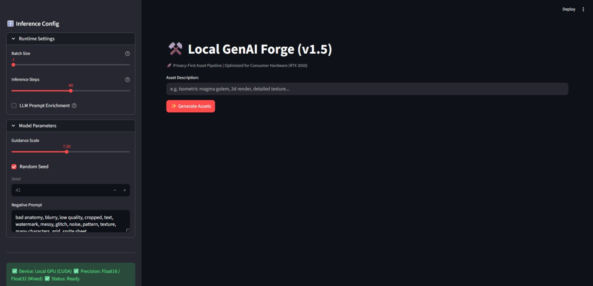
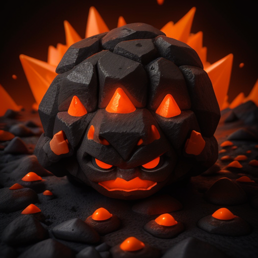

---

# ⚒️ Local GenAI Forge

   
---

# ⚒️ Local GenAI Forge

**A local, privacy-focused tool for prototyping game assets on consumer hardware.**



## ❓ Why did I build this?

I started this project primarily **to learn and explore** how Generative AI pipelines work under the hood.

While experimenting, I realized that running these models locally (instead of relying on cloud APIs like Midjourney) naturally solves some critical problems in game development:

1.  **Privacy:** Keeps game concepts and IP safe on your own machine.
2.  **Control:** Allows for consistent results (fixed seeds) which is hard to get with cloud tools.
3.  **Cost:** Eliminates subscription fees by utilizing consumer hardware.

This project is my implementation of that "local & private" workflow.

---

## ⚙️ Technical Approach

The main engineering challenge was running high-fidelity models (like *DreamShaper v8*) on a standard gaming laptop with limited memory (**The "4GB VRAM" Challenge**).

To make this work on an RTX 3050, I implemented specific optimization techniques using Python and the HuggingFace `diffusers` library:

*   **Memory Optimization (CPU Offloading):** The pipeline dynamically moves model components between RAM and VRAM during inference, preventing "Out of Memory" crashes on 4GB cards.
*   **Precision Management:**
    *   *Generation:* Runs in `Float16` for speed.
    *   *Decoding (VAE):* Forced to `Float32` with a custom VAE (`mse-840000`) to fix the "muddy/blurry" artifacts common in low-precision setups.
*   **Reproducibility System:** Every generated image is automatically paired with a `.txt` log file containing the exact Seed, Prompt, and Settings. This ensures that any asset can be recreated perfectly by the art team later.

---
## 🔌 Modularity (How to improve quality)

This tool is currently configured for **performance on low-end hardware**. However, it is built to be modular.

You are not locked into the default model. If you have better hardware or want a different art style (e.g., Realistic, Anime, Pixel Art), you can simply change the `base_model` line in `config.yaml`.

```yaml
# Example: Switching to a different model in config.yaml
model:
  base_model: "SG161222/Realistic_Vision_V5.1_noVAE"
```
---

## 🚀 Installation

I utilize **`uv`**, a Rust-based package manager, to handle dependency resolution 10-100x faster than standard pip.

### Option A: The "One-Click" Setup (Windows)
I wrote a batch script to automate the entire environment setup, including the tricky CUDA/Torch bindings.

1.  Clone this repository.
2.  Double-click **`setup_windows.bat`**.
3.  Wait for the installation to complete.
4.  Double-click **`run_app.bat`** to launch the dashboard.

### Option B: Manual Setup (Terminal)

```bash
# 1. Install uv (if not installed)
pip install uv

# 2. Create venv
uv venv
# Activate it: .venv\Scripts\activate (Win) or source .venv/bin/activate (Linux/Mac)

# 3. Install PyTorch (CUDA 11.8 Build)
uv pip install torch torchvision --index-url https://download.pytorch.org/whl/cu118

# 4. Install Dependencies
uv pip install -r requirements.txt

# 5. Run
streamlit run ui/app.py
```

---

## 🖼️ Gallery & Benchmarks

**Hardware:** NVIDIA RTX 3050 (4GB VRAM)
**Inference Time:** ~12-14 seconds per image (512x512, 40 steps)

| Asset Type | Output Sample | Log Data | Raw Prompt (LLM Off) |
| :--- | :--- | :--- | :--- |
| **Magma Golem** |  | Seed: `3993855977`<br>Step: 40<br>VRAM: 1.75GB | `a tiny cute magma golem, made of dripping lava and obsidian rocks, glowing core, bright orange and black, angry expression, isometric view, 3d render, blender style, volumetric lighting, high contrast, masterpiece` |
| **Crystal Potion** |  | Seed: `1708371718`<br>Step: 40<br>VRAM: 1.75GB | `an isometric magic potion bottle, ornate golden stopper, swirling galaxy liquid inside with glitter stars, thick ancient glass texture, caustics lighting, magical aura, dark tabletop background, crisp details, 3d render` |

---

## 🛠️ Tech Stack

*   **Core:** Python 3.10+, PyTorch (CUDA)
*   **Inference:** HuggingFace Diffusers, Transformers
*   **Optimization:** Accelerate, SafeTensors
*   **UI:** Streamlit
*   **LLM Integration:** OpenAI API (Optional, for prompt enrichment)

---

